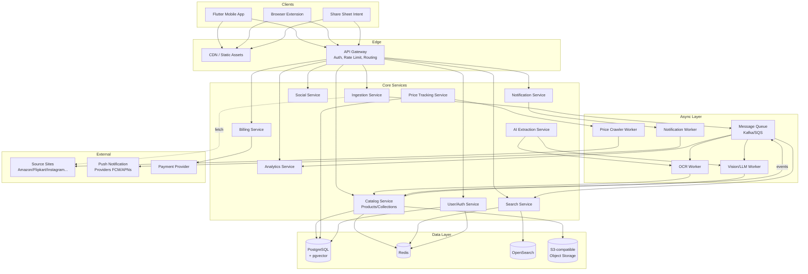
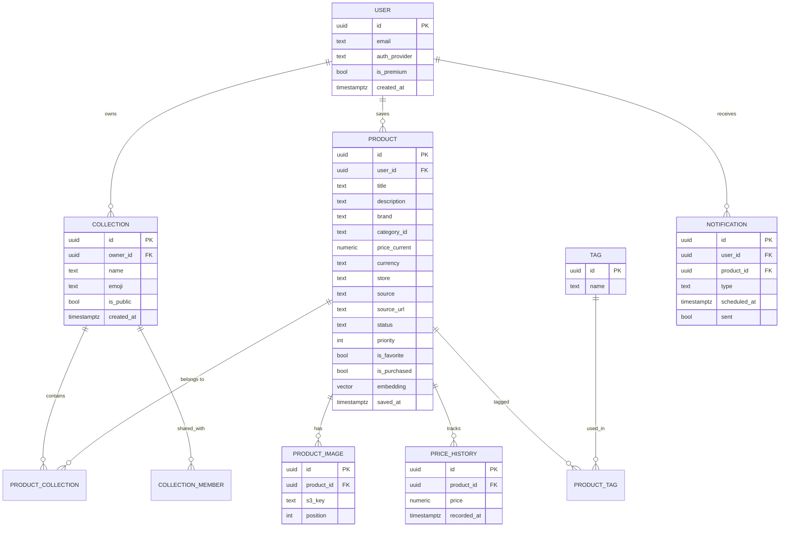
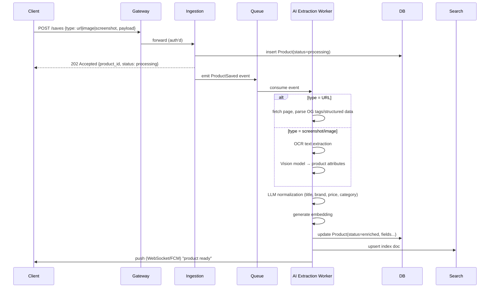
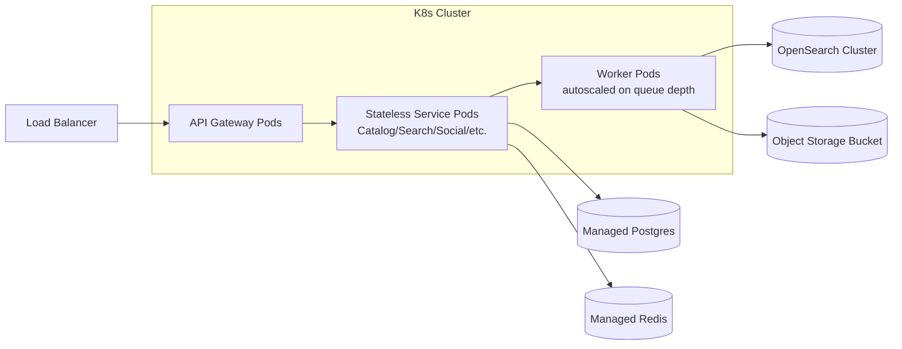

# Product Gallery — System Architecture

Companion to the PRD. Two layers: **High-Level (HLD)** — the big boxes and how they talk to each other — and **Low-Level (LLD)** — the internals of each box: data models, APIs, pipelines, and infra choices.

---

## 1. High-Level Architecture

### 1.1 Overview diagram

### 1.2 What each piece does

| Component | Responsibility |
|---|---|
| **Clients** | Flutter app (Android/iOS), browser extension, native share-sheet handlers. Thin — do capture + display, push heavy lifting to backend. |
| **API Gateway** | Single entry point: auth token validation, rate limiting, request routing, request/response logging. |
| **Ingestion Service** | Accepts a "save" from any source (URL, screenshot, image, manual entry). Normalizes it into a raw payload and emits an event. |
| **AI Extraction Service** | Orchestrates OCR, page scraping, vision model, and LLM calls to turn raw input into a structured product record. |
| **Catalog Service** | Owns Product, Collection, Tag, Folder entities — the core CRUD and business logic. |
| **Search Service** | Indexes products into OpenSearch; handles keyword + semantic (pgvector) + filtered search. |
| **Notification Service** | Price drops, back-in-stock, reminders — schedules and dispatches. |
| **Social Service** | Public collections, friends, shared boards, gift/wedding/travel lists. |
| **Analytics Service** | Aggregates dashboard metrics (saved counts, spend, category distribution). |
| **Price Tracking Service** | Periodic re-crawl of saved product URLs, price history storage, deal detection. |
| **User/Auth Service** | Signup/login, sessions, JWT issuance, profile, premium entitlement flags. |
| **Billing Service** | Subscription management, webhooks from payment provider. |
| **Message Queue** | Decouples fast user-facing writes from slow AI/crawling work. |
| **PostgreSQL + pgvector** | System of record + embeddings for semantic search. |
| **Redis** | Session cache, hot-product cache, rate-limit counters, dedupe locks. |
| **OpenSearch** | Full-text + faceted search index, denormalized from Postgres. |
| **Object Storage (S3-compatible)** | Product images, screenshots, OCR source images. |

### 1.3 Key design principle: **write path is fast, enrichment is async**

When a user shares a product, they need a "saved!" confirmation in under a second. AI extraction, OCR, and price-history backfill should never block that. So:

1. Ingestion writes a minimal placeholder record synchronously (status: `processing`).
2. An event is queued.
3. Workers enrich the record in the background.
4. Client gets a real-time update (WebSocket/SSE or push) when enrichment completes.

This single decision shapes most of the low-level design below.

---

## 2. Low-Level Architecture

### 2.1 Data model (PostgreSQL)

Notes:
- `status` on `PRODUCT` drives the async flow: `processing → enriched → failed`.
- `embedding vector(1536)` (pgvector) enables semantic search directly in Postgres for smaller scale; OpenSearch takes over as the primary search index once volume grows (see 2.4).
- `category_id` references a static taxonomy table (Main + nested sub-categories, adjacency-list or `ltree` for unlimited nesting).
- Collections use a join table (`PRODUCT_COLLECTION`) since a product can live in multiple collections.

### 2.2 Ingestion pipeline (the "Universal Save" path)

Per-source handling differences that matter at the low level:
- **URL sources (Amazon, Flipkart, Myntra):** prefer structured-data scraping (JSON-LD, OpenGraph) over full-page LLM parsing — cheaper and more reliable. Fall back to LLM parsing only if structured data is missing.
- **Social sources (Instagram, Pinterest, Reddit, YouTube):** usually only an image/caption is available — route straight to vision + LLM, no product page to scrape.
- **Screenshot/camera import:** OCR first, then a small vision-language model to map extracted text + image regions to fields, then LLM to clean up.
- **Duplicate detection:** before insert, hash the normalized URL (or perceptual-hash the image) and check Redis/DB for an existing match within the same user's account; if found, increment a "seen count" instead of creating a new row.

### 2.3 AI Extraction Service internals

- **Orchestrator pattern**: a lightweight state machine per job (`fetch → ocr/vision → normalize → embed → index`), each step idempotent and retryable, state persisted in the queue message or a `jobs` table so a crashed worker can resume.
- **Model routing**: cheap/fast model for structured-data cases, larger vision-language model reserved for screenshot/camera cases to control cost.
- **Caching**: identical source URLs across different users are extracted once and the structured result is cached (keyed by normalized URL) for a TTL, since product metadata rarely changes minute-to-minute.
- **Rate limiting outbound**: per-domain concurrency caps when scraping (Amazon, Flipkart, etc.) to avoid IP blocks — use a domain-level token bucket in Redis.

### 2.4 Search Service

- **Dual-index strategy**:
  - OpenSearch for keyword + faceted filters (category, price range, store, tags, purchased/wishlist, date).
  - pgvector (or a dedicated vector DB later) for semantic queries like *"gifts for mom"* or *"black sneakers under ₹5000"*.
- **Query flow**: natural-language query → LLM parses it into `{intent, filters, semantic_residual}` → structured filters go to OpenSearch, semantic residual goes to vector search → results merged/re-ranked → returned.
- **Sync**: Catalog Service writes to Postgres are the source of truth; a change-data-capture stream (Debezium or outbox-pattern events on the queue) keeps OpenSearch in sync, not a dual-write from the app layer.
- **Latency budget** (PRD requires <200ms): keep the hot path to filter-only queries hitting OpenSearch directly; only invoke the LLM query-parsing step for genuinely natural-language queries, and cache parsed-query → filter mappings.

### 2.5 Price Tracking Service

- Cron-scheduled workers pull a batch of tracked `source_url`s (staggered, not all at once), re-check price, write to `PRICE_HISTORY`, and diff against the last known price.
- On a drop beyond a threshold (or back-in-stock transition), emit a `PriceChanged` event → Notification Service.
- Crawl frequency tiered: premium users' items checked more often than free users' (ties into monetization).

### 2.6 Notification Service

- Consumes events (`PriceChanged`, `BackInStock`, `NewVersionReleased`, reminder timers).
- A scheduler (e.g., cron + a `notifications` table with `scheduled_at`) handles "revisit saved item" nudges and seasonal reminders.
- Fan-out to FCM/APNs for push; batches per-user to avoid notification spam (rate cap per user per day).

### 2.7 Auth & security

- JWT access token (short-lived) + refresh token, issued by User/Auth Service; Gateway validates the access token on every request.
- Row-level ownership checks in Catalog Service (a user can only mutate their own products/collections; public collections are read-only to others).
- Signed, expiring URLs for S3 object access (no public buckets).
- Secrets/API keys for scraping and AI providers held in a secrets manager, never in app config.

### 2.8 Deployment view

- Services and workers as separate deployments so worker pools (OCR/LLM-heavy) can autoscale on **queue depth**, independent of API traffic which autoscales on **request rate**.
- Multi-AZ managed Postgres with read replicas for the Analytics Service (keeps heavy aggregate queries off the primary write path).

---

## 3. How this maps to the PRD's roadmap phases

| Phase | What's actually built |
|---|---|
| **Phase 1** | Ingestion (URL/manual only), Catalog Service, Postgres schema, basic OpenSearch keyword search. No async AI yet — extraction can be synchronous/manual at this stage. |
| **Phase 2** | Introduce the Queue + AI Extraction Service (OCR, vision, LLM normalization), pgvector embeddings, semantic search layer. |
| **Phase 3** | Price Tracking Service, Social Service (shared collections), browser extension client. |
| **Phase 4** | AI shopping copilot (LLM agent over Catalog + Search + Price History), recommendation engine (Similar Products), purchase-insight analytics. |

This lets you ship Phase 1 as a fairly conventional CRUD app, and add the queue/worker/AI layers incrementally without re-architecting — the async "processing → enriched" pattern is the one thing worth building correctly from day one, since retrofitting it later means migrating live data.
